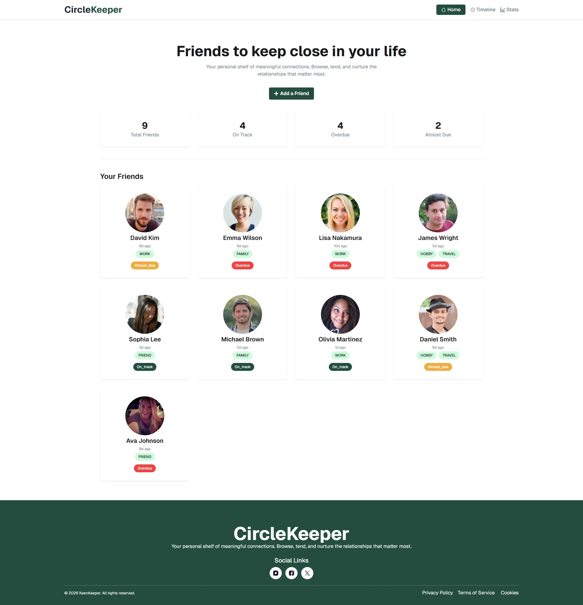

# 💙 CircleKeeper — Keep Your Friendships Alive

## 📌 Overview

CircleKeeper is a modern and responsive friendship management web app that helps users stay connected with their friends. It allows users to track interactions, set communication goals, and visualize relationship activity through an intuitive interface.

This project focuses on improving real-life connections by reminding users to maintain regular contact with their friends.

---

## 📸 Project Screenshot



## 🚀 Live Demo

🔗 https://circlekeeper.netlify.app

---

## 🛠️ Technologies Used

- ⚛️ React.js (Frontend Library)
- 🧭 React Router DOM (Routing)
- 🎨 Tailwind CSS + 🌼 daisyUI (Styling & UI Components)
- 📊 Recharts (Data Visualization)
- 🔔 React Toastify (Notifications)
- 🎯 React Icons (Icon Library)
- 📦 JSON (Local Data Handling)

---

## ✨ Key Features

- Fetch JSON data and view multiple friend profiles with detailed information
- Automatically updates timeline with real-time data
- Interactive Pie Chart showing communication patterns

---

## 📱 Responsiveness

The application is fully responsive and works seamlessly across:

- 📱 Mobile Devices
- 📲 Tablets
- 💻 Desktops

---

## 📦 NPM Packages Used

```bash
react
react-dom
tailwindcss
daisyui
react-spinners
react-router
react-icons
react-toastify
recharts
```

## 🚀 Run This Project Locally

### Clone the Repository

```bash
git clone <your-repository-url>
cd project-name
```

### Install Dependencies

```bash
npm install
```

### Start the Development Server

```bash
npm run dev
```

## 🔥 Future Improvements

- 🔍 Search & filter friends and timeline
- 📅 Sorting timeline by newest/oldest

---

⭐ Don’t forget to give this project a star if you like it!
